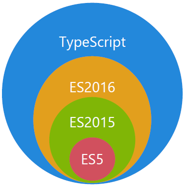
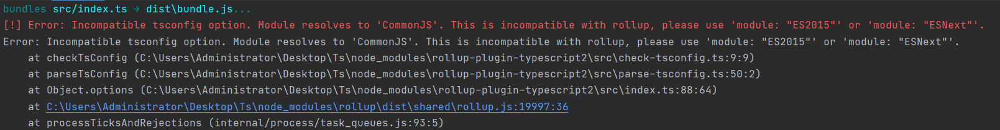

## 一、TS是什么

- TS是微软开发的一种开源的编程语言

- TS是JS的一个超集，遵循ES5/ES6/ES7规范，拓展了JS语法，添加了可选的静态类型和基于类的面向对象编程

- TS与 ES5、ES2015 和 ES2016 之间的关系

  

  

### 1.1、TS与 JS的区别

| TypeScript                                     | JavaScript                                 |
| ---------------------------------------------- | ------------------------------------------ |
| JavaScript 的超集用于解决大型项目的代码复杂性  | 一种脚本语言，用于创建动态网页             |
| 可以在编译期间发现并纠正错误                   | 作为一种解释型语言，只能在运行时发现错误   |
| 强类型，支持静态和动态类型                     | 弱类型，没有静态类型选项                   |
| 最终被编译成 JavaScript 代码，使浏览器可以理解 | 可以直接在浏览器中使用                     |
| 支持模块、泛型和接口                           | 不支持模块，泛型或接口                     |
| 社区的支持仍在增长，而且还不是很大             | 大量的社区支持以及大量文档和解决问题的支持 |

### 1.2、环境配置

1. 安装

   ```js
   npm install typescript -g
   ```

2. 验证

   ```js
   tsc -v
   // Version 版本号
   ```

3. 线上编译地址（[TypeScript Playground](https://typescript-play.js.org/)）

4.  本地编译(构建工具rollup)

#### 1.2.4 rollup构建ts项目

1. ```js
   1、npm install ts-node -g
   2、tsc --init 	// 初始化ts配置文件
   3、npm init -y	// 初始化配置文件
   4、npm install rollup typescript rollup-plugin-typescript2 @rollup/plugin-node-resolve rollup-plugin-serve -D		//	安装依赖
   rollup-plugin-typescript2 		// 解析ts文件
   @rollup/plugin-node-resolve		// 解析第三方模块 
   rollup-plugin-serve				// 启动本地服务
   ```

2. rollup.config.js

   ```js
   import ts from 'rollup-plugin-typescript2'                  // 解析ts创建
   import { nodeResolve } from '@rollup/plugin-node-resolve'   // 解析第三方模块插件
   import serve from "rollup-plugin-serve"                     // 启动本地服务
   import path from 'path'
   
   export default {
       input: 'src/index.ts',
       output:{
           format: 'iife',      // 立即执行
           file: path.resolve(__dirname,'dist/bundle.js'),
           sourcemap: true,     // 产生源码映射文件
       },
       plugins:[
           ts({
              tsconfig: path.resolve(__dirname,'tsconfig.json')
           }),
           nodeResolve({
               extensions: ['.js','.ts']
           }),
           serve({
               open: true,
               openPage: '/public/index.html',     // 本地服务入口页面
               contentBase: '',
               port: 9527
           })
       ]
   }
   
   ps: 如果开启源码映射，tsconfig.js中同步开启
   ```

3.  错误处理

```
tsconfig.json中module模式更改为ESNext
```

